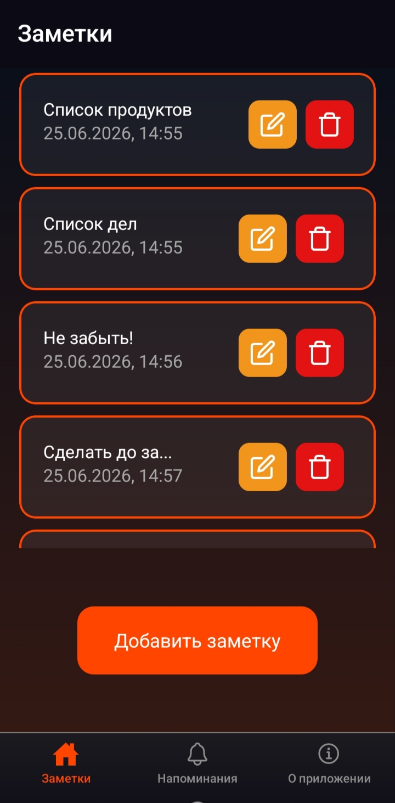
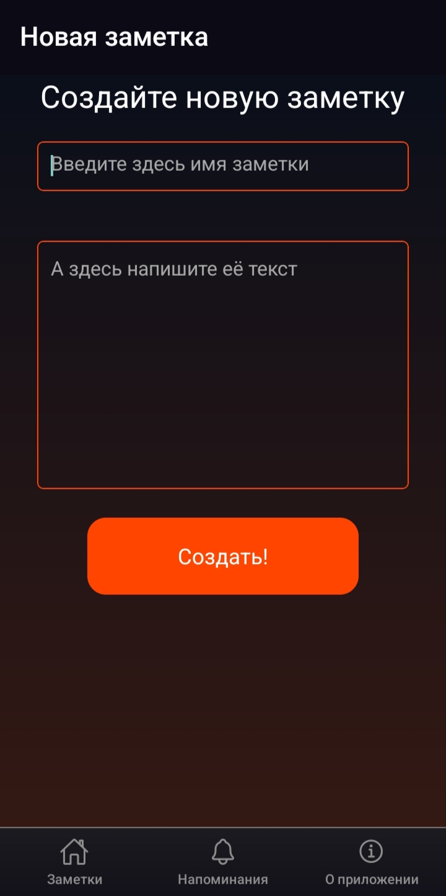
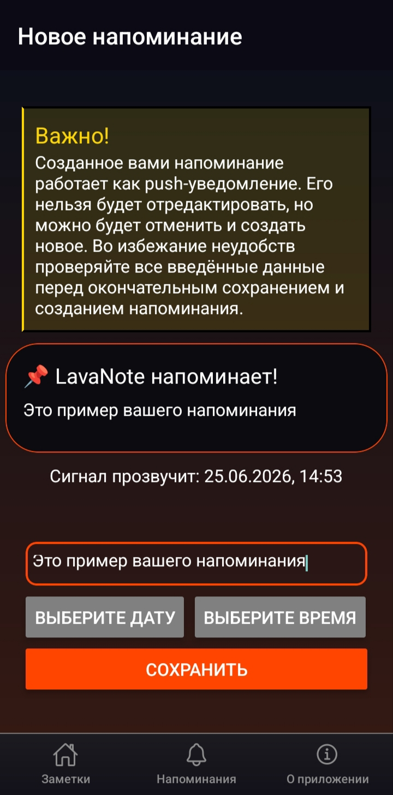

# LavaNote - заметки

## Описание
LavaNote - это простое android приложение для создания текстовых заметок на телефоне.

## Скриншоты
<table>
  <tr>
    <td></td>
    <td></td>
  </tr>
  <tr>
    <td></td>
    <td></td>
  </tr>
</table>

## Как установить?
1. Перейдите в раздел релизов.
2. Скачайте понравившийся apk файл.
3. Откройте загруженный файл на устройстве и дождитесь завершения установки.
4. Готово! Можно пользоваться.

## Использование
Интерфейс интуитивно понятный. Просто создавайте новые заметки посредством нажатия 
на кнопку на главном экране. Далее впишите заголовок и содержание заметки, после чего 
новая заметка появится в списке на главном экране. Не бойтесь совершать ошибки, ведь после 
их можно будет поправить, нажав на значок с карандашиком, на нужной заметке. 
Вы также можете узнать больше о возможностях приложения на экране "О приложении", используя 
панель навигации внизу окна.  
А на экране напоминаний можно создать короткое напоминание и задать ему время с датой. Оно 
прозвучит в этот эпизод вашей жизни в виде push-уведомления. Это удобно если нужно не забыть 
о чём-то важном. 